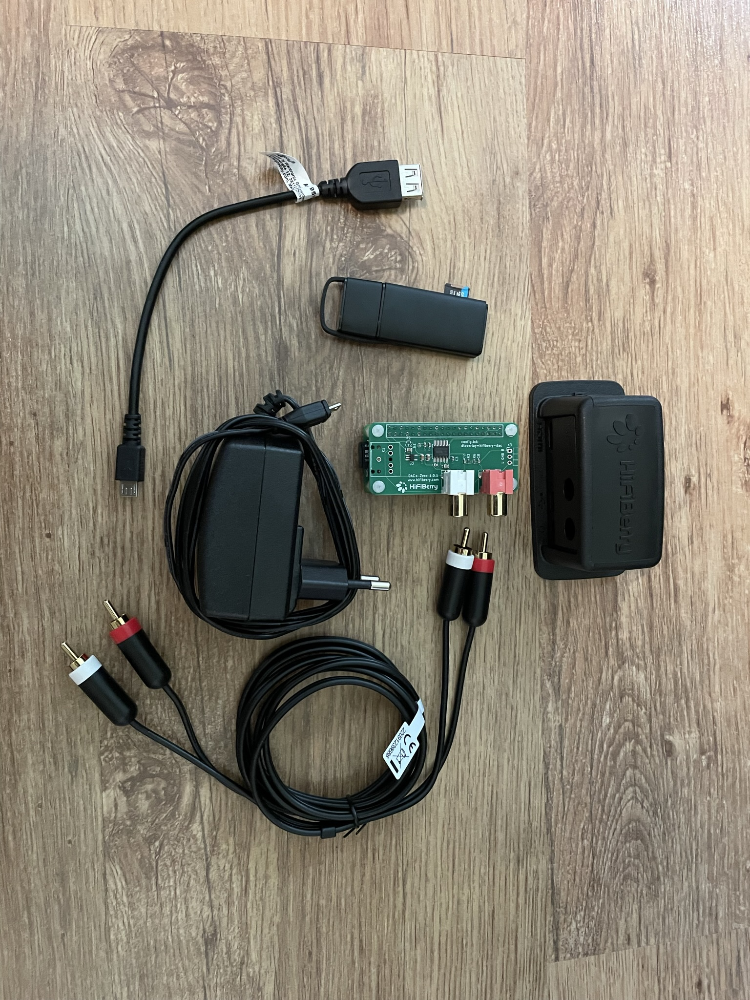

# Projekti

Olen vähän yli kymmenen vuotta ostellut suht aktiivisesti CD-levyjä ja minulle
on tässä vuosien varrella kertynyt noin 100 levyn kokoelma. Tämän projektin
tarkoitus on ladata CD kokoelma paikalliselle serverille (tässä tapauksessa vain
muistikortti) josta pystyn helposti soittamaan levyjä.

## Projektin komponentit


- [Raspberry Pi Zero W](https://www.raspberrypi.com/products/raspberry-pi-zero-w/)
- Micro-USB virtalähde
- [HiFiBerry DAC+ Zero](https://www.hifiberry.com/shop/boards/hifiberry-dac-zero/)
- [HiFiBerry case for DAC+ Zero](https://www.hifiberry.com/shop/cases/hifiberry-case-for-dac-zero/)
- [USB Muistikortinlukija](https://www.clasohlson.com/fi/Muistikortinlukija-USB-3.2/p/39-1354)
- [RCA äänikaapeli](https://www.clasohlson.com/fi/Äänikaapeli-RCA-Exibel/p/38-8092-1)
- [USB A naaras - Micro USB uros adapteri](https://www.verkkokauppa.com/fi/product/160873/Goobay-OTG-A-naaras-MicroB-uros-USB-adapteri)
- [moOde™ audio player](https://moodeaudio.org/)

Käytän tässä projektissa Raspberry Pi Zero W:tä. Voit myös käyttää muita
Raspberry malleja, mutta muista ostaa siihen sopiva DAC komponentti HiFiBerry
DAC+ Zero tilalle.

Alunperin minulla oli tarkoitus käyttää musiikki soittimen käyttöjärjestelmänä
HifiberryOS, mutta minun Raspberry Pi Zero W oli vaikeuksia pyörittää sitä joten
päädyin vaihtamaan sen Moode audio playeriin. En tutkinut paljoankaan eri
soittimia, Moode toimii ilman suurempia ongelmia ja se riittää minulle. Jos
haluan joskus vaihtaa soitinta se on helppoa kun musiikki on eri muistikortilla
kuin käyttöjärjestelmä.

Monet kehuvat myös Volumio soitinta, mutta en ole kokeillut sitä.

## USB SD kortin lukijan asennus ja konffaus

```bash
ssh 192.168.1.110
# Etsi SD kortti asema. Minulla se löytyi nimellä sda1
lsblk
# Luo kansion mihin levyt mountataan. Moode löytää kappaleet /media kansion alta.
sudo mkdir /media/Music
# Mountataan asema (/dev/sda1) kansioon (/media/Music)
sudo mount /dev/sda1 /media/Music
# fstab hoitaa toissijaisten asemien mäppäämisen. Lisätään meidän uusi mount sinne jotta se ei häviä uudelleen käynnistyksen yhteydessä
echo "/dev/sda1 /media/Music exfat defaults 0 0" | sudo tee -a /etc/fstab
# Mountataan vielä lopuksi kaikki asemat mitkä löytyy fstab tiedostosta ja katsotaan ettei komentoriville tule mitään virheitä.
mount -a
# Katsotaan että albumit löytyvät
ls /media/Music
```

## Musiikin lisääminen

### CUERipper


[CUERipper](http://cue.tools/wiki/CUERipper) on helppokayttöinen työkalu mikä
pystyy ripata CD:n, hakee albumin kuvan ja varmetaa, että tiedostot ovat
korkealaatuisia. CUERipper pystyy tekemään kaikenlaista, mutta hyvin pitkälle
pääsee kun katsoo ylhäällä on valittu oikea levy, varsinkin jos levy on erikois
tuplalevy kannattaa katsoa että levymäärä on oikea, ja valitsee ala oikeasta
nurkasta halutun äänitiedosto formaatin ja tracks tai image riippuen haluaako
että jokainen kappale on oma tiedosto vai että koko albumi on yhdessä
tiedostossa. Minä olen valinnut flac ja tracks jolloin jokaisesta kappaleesta
tulee oma haviötön tiedosto.

CUERipper osaa hakea albumin perustiedot jotka usein riittävät peruskäyttöön,
mutta jos haluat hakea enemmän metatietoa kappaleille kuten genretiedot
suosittelen käyttämään [MusicBrainz Picard](https://picard.musicbrainz.org/)
ohjelmaa. Picard on hieman monimutkainen ohjelma käyttää mutta heidän sivujensa
Quick Start ohjeilla pääsee hyvin liikkeelle.

_Vinkki: jos haluat että Picard hakee genre tiedot käy klikkaamassa päälle
Options -> Options -> Genres -> Use gernes from MusicBrainz. Suosittelen
laskemaan Minimal genre usage reilusti alle 90% jos haluat saada myös
alagenrejä._

### Windows Media Player

Jos CUERipper ei onnistu rippaamaan levyä yritämme uudelleen Windows Media
Playerillä. Windows media player ei varmenna rippauksen laatua joten kannttaa
itse kuunnella tiedostot läpi ennen kuin lataa niitä serverille

### SFTP

Koska /media/ on suojattu kohde tiedonsiirto sftp komento pitää ajaa sudo
oikeuksilla.

#### SFTP komentoriviltä

Host puolella mennään musiikki tiedostojen kansion parenttiin ja ajetaan
komento:

- sftp -s "sudo /usr/lib/openssh/sftp-server" 192.168.1.110
- sftp puolella mennään /media/Music kansioon
- cd /media/Music
- put -r host_levyn_kansio Tämä lataa "host_levyn_kansio" kansion hostin
  puolelta (Windows) serverille (Raspberry pi)

#### SFTP WinSCP:llä

Login ikkunasta aseta käyttäjänimi

- Kilkkaa "Advanced"
- Advanced Site Settings ikkunasta valitaan Environment -> SFTP. SFTP Server
  kenttään asetetaan "sudo /usr/lib/openssh/sftp-server"
- Klikataan OK ja Save
- Login ja kirjaudutaan sisään salasanalla. WinSCP ikkunasta pystyt
  drag'n'droppailemaan tiedostoja ja kansioita windowsin ja Raspberry pi:n
  välillä

Lisää "folder.jpg" mihin tahansa kansioon nii Moode automaattisesti käyttää
kuvaa kansion kuvakkeena.

## MoOde Audio

Käytän musiikkisoittimena MoOde audio playeriä. Moode tarjoaa hyvän
responsiivisen käyttöliittymän joka toimii hyvin sekä pieneltä kännykän ruudulta
sekä laajalta 2k tietokoneen näytöltä.

Moode audio tarjoaa suoraan tuen musikkitiedostojen kuuntelun lisäksi musiikin
soittamiseen airplayn ja bluetoothin kautta, mutta näissä molemmissa on
haasteita. Bluetoothin saan yhdistetyä mutta en saa ääntä kuulumaan. Airplayn
saan yhdistettyä ja äänikin toimii, mutta ääni välillä rätisee ja pätkii.
Epäilykseni on että nämä johtuu enemmän Raspberry pi zero W laitteesta kuin
Moode soittimesta ja nämä ominaisuudet saattavat toimia paremmin uudemmilla ja
tehokkaammilla laitteilla.

Moode sallii myös musiikin kuuntelun Spotify Connectin kautta. Minulla ei ole
Spotify tiliä niin en ole varmentanut tämän toimintaa.

Lue lisää soittimesta [https://moodeaudio.org/](https://moodeaudio.org/)

### Muut vaihtoehdot

[HifiberryOS](https://www.hifiberry.com/hifiberryos/)

[Volumio](https://volumio.com/get-started/).

[piCorePlayer](https://www.picoreplayer.org/)

## Lopputulos


