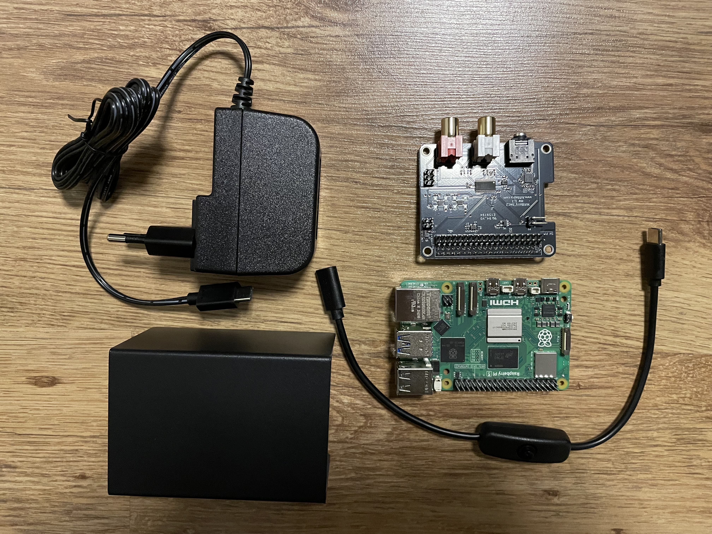
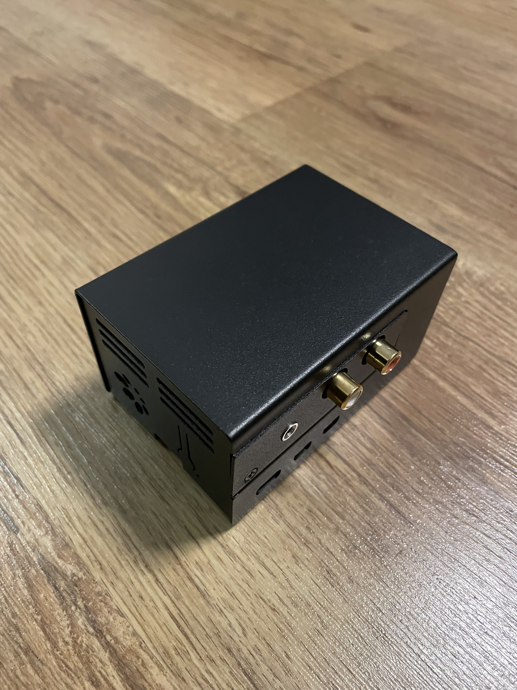

# Raspberry Pi päivitys

Minulla oli vanhalla Raspberry Pi Zero W:llä ogelmia joten päädyn päivittämään sen Raspberry Pi 5:een. Zero W:ssä Moode
playerin Web käyttöliittymä aina ei avaudu oletetusti. Tämä usein tapahtui sen jälkeen jos oli pitkäksi aikaa, kuten yön
ylitse, jäänyt käyttöliittymä välilehti selaimeen auki. Epäilykseni on että joko serveri tai MPD yrittää ylläpitää
yhteyttä mikä johtaa pitkä ajan kuluttua siihen että laitteesta loppuu muisti ja web serveri tiputetaan alas.

Toinen syy vaihtoon oli heikohko äänenlaatu. En ole varma johtuko tämä Raspberry Pi Zero W:stä vai heikosta
DA-muuuntimesta.

## Projektin komponentit



- [Raspberry Pi 5 4GB](https://www.raspberrypi.com/products/raspberry-pi-5/)
- [HiFiBerry DAC2 Pro](https://www.hifiberry.com/shop/boards/hifiberry-dac2-pro/)
- [Metallinen kotelo](https://www.hifiberry.com/shop/cases/dealing-with-blocked-p5-holes-6/)
- [USB-C Virtalähde](https://www.hifiberry.com/shop/accessories/raspberry-pi4-power-supply-5v-3a/)
- [USB-C Virta kytkin](https://www.hifiberry.com/shop/accessories/usbc-power-switch/)

## Päivitys prosessi

Pelkkä vanhan Raspberryn muistikortin laittaminen uuteen sisään ei riittänyt valitettavasti joten jouduin asentamaan OS
uudeksi. Tämä ei haitannut minua, koska joka tapauksessa minun kannatti päivittää Moode Audio versioon 9.1.0.

Moode Audion asennus oli helppo tehdä [Raspberry Pi Imager](https://www.raspberrypi.com/software/) ohjelmalla. Moode
Audio on myös tehnyt hyvät
[ohjeet asennukseen](https://github.com/moode-player/docs/blob/main/setup_guide.md#4-imager-tutorial).

Tällä kertaa minun SD kortin lukija oli samantien näkyvissä, joten minun ei tarvinnut alkaa sitä mounttaamaan tai tehdä
sille mitään muutakaan. Riitti kun liitin SD kortin lukija USB porttiin ja kävin regeneroimassa musiikki tietokannan
sekä albumien kuvat Moode Audion "Library" asetuksissa.

Moode Audion asetukset kannattaa tarkistaa läpi että kaikki on oikein. Varsinkin kannattaa varmistaa että "Audio"
asetuksissa "Output device" ja "Named I2S device" on asetettuna oikein. Minulla HiFiBerry DAC2 Pro näkyi nimellä
HiFiBerry DAC+. Minulla on ulkoinen vahvistin joten asetin vielä "Volume type" arvoksi "Fixed (0db)" jolloin hallitsen
äänenvoimakkuutta pelkästään vahvistimen kautta.

## Tidal Connect

Otin päivityksen yhteydessä Tidal Connect ominaisuuden minkä avulla pystyn soittamaan musiikkia Moode Audion kautta
suoraan tidal sovelluksesta. Moode Audio ei tue Tidal Connectia suoraan, joten käytän
[Tony Trompin](https://github.com/TonyTromp) ja [Giovanni Fulcon](https://github.com/GioF71) kehittämää
[tidal-connect](https://github.com/GioF71/tidal-connect) docker palvelua. Palvelun asennus oli helppoa ja suoraviivaista
selkeän ohjeistuksen ansiosta.

Asennus pähkinänkuoressa

```bash
# ssh yhteys moode audio raspberry Pi:hin
ssh 192.168.1.110 
# Esivaatimuksena docker ja git asennettuna Raspberry Pi:ssä
# Mene koti kansioon
cd ~
git clone https://github.com/GioF71/tidal-connect.git
cd tidal-connect
# Generoi vaadittavan asetukset "HiFiBerry DAC+" DA-muuntimelle
bash ./configure.sh -n "sndrpihifiberry" -f "HiFiBerry DAC+" -m "Raspberry Pi"
# Käynnistä docker kontti taustalla
docker compose up -d
```

Kun docker kontti on käynistynyt odota hetki ja tarkista lokeilta näkyykö ongelmia

```bash
docker compose logs
```

Jos näkyy virhe "error while loading shared libraries: libsystemd.so.0: ELF load command alignment not page-aligned"
seuraa
[https://github.com/GioF71/tidal-connect?tab=readme-ov-file#issue-on-the-raspberry-pi-5](https://github.com/GioF71/tidal-connect?tab=readme-ov-file#issue-on-the-raspberry-pi-5)
näkyviä ohjeita.

Jos kaikki on kunnossa "HiFiBerry DAC+" pitäisi olla näkyvissä Tidal sovelluksen "kaiuttimet" listassa. Moode Audion
käyttöliittymällä ei tarvitse tehdä mitään muutoksia.

Huom. Kuten tidal-connect:in readme:ssä lukee, tämä ei ole Tidalin puolelta tuettu ominaisuus ja saattaa lakata
toimimasta hetkenä minä hyvänsä, mutta ainakin kirjoitushetkellä tämä toimii moitteetta.

Katso tarkemmat ohjeet tidal-connect git repositorystä
[https://github.com/GioF71/tidal-connect](https://github.com/GioF71/tidal-connect)

## Lopputulos


